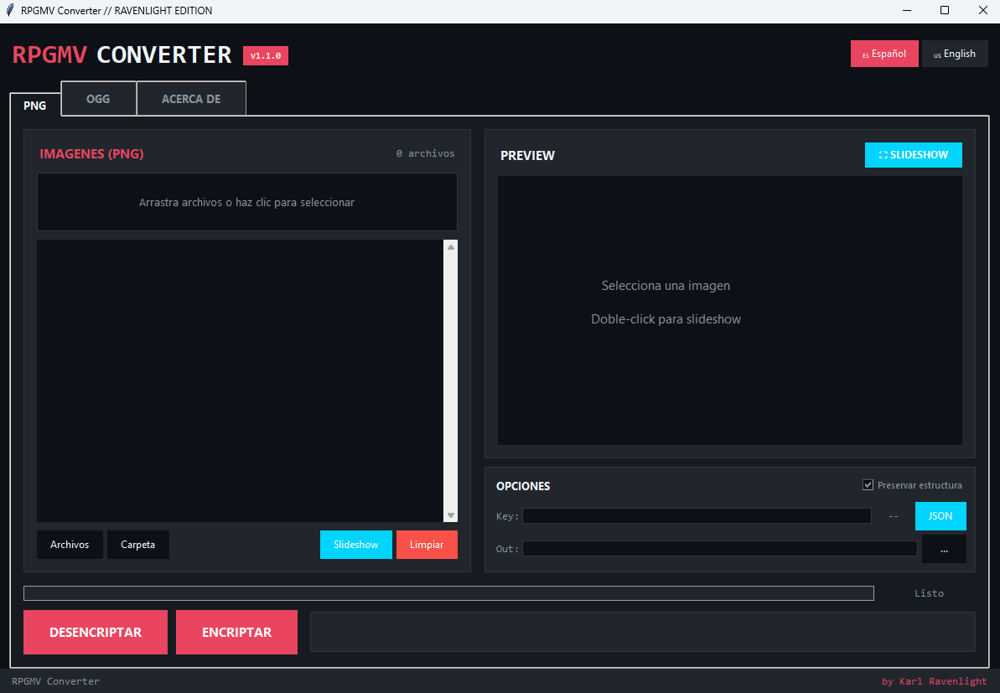

# RPGMV Converter

<div align="center">


**Encrypt and decrypt images and audio from RPG Maker MV/MZ games**

Made specifically for **Look Outside**, but works with any RPG Maker MV/MZ game.

[Download](#download) • [Features](#features) • [Usage](#usage) • [Screenshots](#screenshots)

</div>

---

## Features

### 🖼️ Image Support
- Decrypt `.png_`, `.rpgmvp` encrypted images to standard PNG
- Encrypt PNG images back to RPGMV format
- **Live preview** of images before processing
- **Fullscreen slideshow** with sidebar file list
- Keyboard navigation (arrows, space, ESC)

### 🎵 Audio Support
- Decrypt `.ogg_`, `.rpgmvo` encrypted audio to standard OGG
- Encrypt OGG audio back to RPGMV format
- Automatic encryption key detection from `System.json`

### 🔧 Advanced Options
- **Auto-detect encryption key** from game's `System.json`
- Manual key input for custom scenarios
- **Preserve folder structure** when exporting
- Batch processing for entire game folders

### 🌐 Multi-language Support
- 🇪🇸 Spanish (Español)
- 🇺🇸 English

### 🎨 Modern UI
- Dark theme interface
- Progress bar with real-time feedback
- Drag & drop file support
- Tabbed interface for PNG/OGG

---

## Download

Go to [**Releases**](../../releases) and download the executable for your OS:

| Platform | File | Size |
|----------|------|------|
| Windows | `RPGMV_Converter_Windows.exe` | ~17 MB |
| Linux | `RPGMV_Converter_Linux` | ~28 MB |
| macOS | `RPGMV_Converter_MacOS` | ~13 MB |

### Run from Source

```bash
# Clone the repository
git clone https://github.com/vjravenlight/rpgmv-converter.git
cd rpgmv-converter

# Install dependencies
pip install pillow

# Run
python rpgmv_converter.py
```

---

## Usage

### Basic Usage

1. **Select tab**: Choose PNG (images) or OGG (audio)
2. **Load files**: Click "Folder" to select game's `img` or `audio` folder
3. **Check key**: Encryption key auto-detects from `System.json`
4. **Process**: Click "DECRYPT" to extract, or "ENCRYPT" to re-encrypt

### Encryption Key

The encryption key is stored in the game's `data/System.json` file:

```json
{
  "encryptionKey": "d0013f0834670ba59194d07647473ad9"
}
```

The program automatically searches for this file when you select a folder. If not found, you can:
- Click "JSON" to manually load a `System.json` file
- Paste the key directly in the Key field

### Folder Structure

When "Preserve structure" is enabled, the output maintains the original folder hierarchy:

```
Input:                          Output:
game/img/                       output/img/
├── characters/                 ├── characters/
│   └── actor1.png_            │   └── actor1.png
├── tilesets/                   ├── tilesets/
│   └── world.png_             │   └── world.png
```

---

## Technical Details

### RPGMV Encryption Format

RPG Maker MV/MZ uses a simple XOR-based encryption:

1. **Header**: 16-byte signature `RPGMV\x00...`
2. **Encrypted data**: First 16 bytes XOR'd with encryption key
3. **Rest of file**: Unencrypted

### Supported Extensions

| Type | Encrypted | Decrypted |
|------|-----------|-----------|
| Images | `.png_`, `.rpgmvp` | `.png` |
| Audio | `.ogg_`, `.rpgmvo` | `.ogg` |

---

## Screenshots



---

## Credits

**Coded by Karl Ravenlight**

- 🌐 [ravenlight.net](https://www.ravenlight.net)
- 📷 [instagram.com/vjravenlight](https://www.instagram.com/vjravenlight)

### Special Thanks

Made specifically for the game **Look Outside** - an RPG Maker MV game.

---

## License

This project is open source. Feel free to use, modify, and distribute.

---

<div align="center">

*"Breaking barriers between creators and their assets"*

**═══════════[ GREETS TO ALL RPGMAKER DEVS ]═══════════**

</div>
